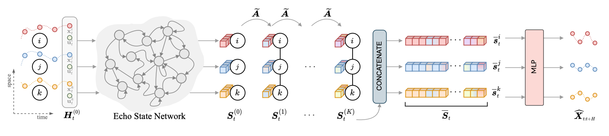

# Scalable Spatiotemporal Graph Neural Networks (AAAI 2023 - [pdf](https://arxiv.org/pdf/2209.06520))

[](#)
[](https://arxiv.org/pdf/2209.06520)
[](https://arxiv.org/abs/2209.06520)

This repository contains the code for the reproducibility of the experiments presented in the paper "Scalable Spatiotemporal Graph Neural Networks" (AAAI 2023). The Scalable Graph Predictor (SGP) is a scalable architecture to process spatiotemporal time series coming from large sensor networks by exploiting a training-free spatiotemporal encoder.

**Authors**: [Andrea Cini](mailto:andrea.cini@usi.ch), [Ivan Marisca](mailto:ivan.marisca@usi.ch), Filippo Maria Bianchi, Cesare Alippi

---

## SGP in a nutshell

SGP is novel approach based on an encode-decoder architecture with a training-free spatiotemporal encoding scheme and where the only learned parameters are in the node-level trainable decoder (an MLP). Representations for each point in time and space can be precomputed and the decoder can be trained by sampling uniformly time and space thus gettig rid of the dependency on sequence lenght and graph size for what concerns the computational complexity of the training procedure. The spatiotemporal encoder relies on two modules: 1) a randomized recurrent neural network for encoding sequences and 2) a propagation process through the graph structure exploiting powers of a graph shift operator.

<div align=center>
	
	<p align=left style="color: #777">Overview of the architecture.</p>
</div>

---


## Directory structure

The directory is structured as follows:

```
.
├── config/
│   ├── traffic/
│   ├── largescale_100nn/
│   └── largescale/
├── datasets/
├── lib/
├── tsl/
├── conda_env.yaml
└── experiments/
    ├── run_traffic_sgp.py
    ├── run_traffic_baselines.py
    ├── run_largescale_sgp.py
    ├── run_largescale_baselines.py
    └── run_closed_form.py

```
Note that, given the size of the files, the datasets are not readily available in the folder. See the next section for the downloading instructions.

## Datasets

The datasets used in the experiment on traffic forecasting are provided by `tsl`. The dataset PV-US can be downloaded from this [link](https://mega.nz/folder/GkgCma7Q#ACECcbXaBRMtx8ucLdkbpQ). The CER-E dataset can be obtained free of charge for research purposes following the instructions at this [link](https://www.ucd.ie/issda/data/commissionforenergyregulationcer/). We recommend storing the downloaded datasets in a folder named `datasets` inside this directory.

## Configuration files

The `config` directory stores all the configuration files used to run the experiment. They are divided into subdirectories according to the experiment they refer to.

## Requirements

To solve all dependencies, we recommend using Anaconda and the provided environment configuration by running the command:

```bash
conda env create -f conda_env.yml
conda activate sgp
```

Note that, we use a custom fork of the original `tsl` library, which is included in the repo. We suggest you to add this root directory to the `PYTHONPATH` before running the experiments, to correctly import both this `tsl` version and the our codebase in `lib`.

## Library

The support code, including the models and the datasets readers can be found in the package named `lib`. Should you need change the paths to the datasets or config location, you have to edit the `__init__.py` file of the library.

## Experiments

The scripts used for the experiments in the paper are in the `experiments` folder.

* `run_traffic_sgp.py` is used to train and evaluate SGP models on traffic datasets. An example of usage is

	```
	python experiments/run_traffic_sgp.py --config traffic/sgp_la.yaml --encoder-name sgp --model-name sgp
	```

* `run_traffic_baselines.py` is used to train and evaluate the baselines (except for DynGESN) on traffic datasets. An example of usage is

	```
	python experiments/run_traffic_baselines.py --config traffic/dcrnn.yaml --model-name dcrnn --dataset-name la
	```

* `run_closed_form.py` is used to fit and evaluate DynGESN on traffic datasets. An example of usage is

	```
	python experiments/run_closed_form.py --config traffic/gesn_la.yaml --encoder-name gesn --dataset-name la

* `run_largescale_sgp.py` is used to train and evaluate SGP models on the large-scale datasets. An example of usage is

	```
	python experiments/run_largescale_sgp.py --config largescale_100nn/sgp_pv.yaml --encoder-name sgp --model-name sgp
	```

* `run_largescale_baselines.py` is used to train and evaluate the baselines on the large-scale datasets. An example of usage is

	```
	python experiments/run_largescale_baselines.py --config largescale_100nn/dcrnn_pv.yaml --model-name dcrnn
	```


## Bibtex reference

If you find this code useful please consider to cite our paper:

```
@article{cini2023scalable,
  title={Scalable Spatiotemporal Graph Neural Networks},
  author={Cini, Andrea and Marisca, Ivan and Bianchi, Filippo Maria and Alippi, Cesare},
  journal={Proceedings of the 37th AAAI Conference on Artificial Intelligence},
  year={2023}
}
```
